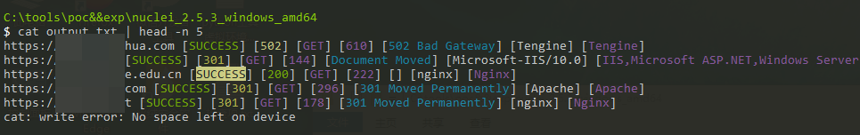

# httpx2Cxlsx
 httpx cmd输出转xlsx 带色彩，快捷方便的进行资产梳理

cmd输出样式

脚本转换后xlsx表格样式

v2.0更新，添加cdn识别、waf识别（内部魔改添加功能，使用后单条转换速度会慢1~5秒，内部多线程数16），改为命令行传参指定输入输出文件，新版转换后xlsx表格样式

**pip安装dns库：pip3 install dnspython**

